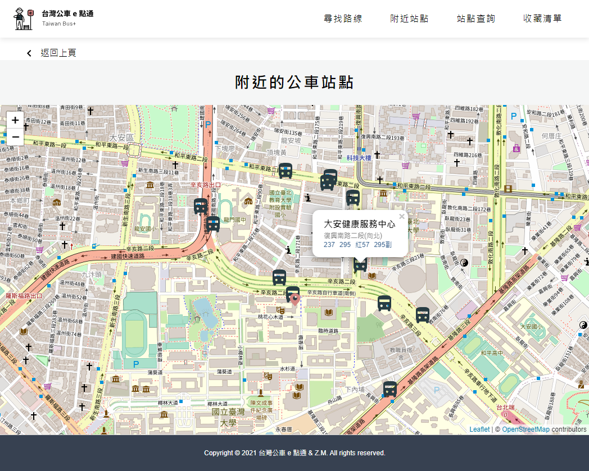

# Taiwan-Bus-Plus
[THE F2E 3rd - Week 3 - Work](https://2021.thef2e.com/news/week3)  
**UI Designer : 鹽酥G**  
[UI source](https://www.figma.com/file/JTb1ArUXnSceYEt6DmCGib/Week3---%E5%85%A8%E5%8F%B0%E5%85%AC%E8%BB%8A%E5%8B%95%E6%85%8B%E6%99%82%E5%88%BB%E6%9F%A5%E8%A9%A2%E6%87%89%E7%94%A8%E6%9C%8D%E5%8B%99?node-id=25%3A3)

> Tool keywords: react, leaflet, tailwind, scss, docker, openstreetmap-api


## Overview
This application helps people to look up the estimated arrival time of bus conveniently.
## Requirement
+ Nodejs-14

## Getting started
### Download code
```sh
$ git clone https://github.com/Zhima-Mochi/Taiwan-Bus-Plus.git
$ cd Taiwan-Bus-Plus
$ npm install
```
### Create environment file in current file path
.env
```
REACT_APP_API_ID=FFFFFFFF-FFFF-FFFF-FFFF-FFFFFFFFFFFF
REACT_APP_API_KEY=FFFFFFFF-FFFF-FFFF-FFFF-FFFFFFFFFFFF
```
[See motc ptx api documentation.](https://motc-ptx-api-documentation.gitbook.io/motc-ptx-api-documentation/)  

You can use .env.example directly.

### Run

```sh
$ npm run start : .env # Or .env.example
```
Now, have fun with http://localhost:3000/.

## Demo
+ [github page](https://zhima-mochi.github.io/Taiwan-Bus-Plus/)
+ [virtual machine](http://108.61.187.106:8089/#/)

## Feature & Introduction

### 初次進入網頁時，需等候十五秒左右更新資料


### 尋找路線與站點查詢使用Trie（字典樹）提供前綴字搜索  


###  附近站點以地圖呈現，點擊後會顯示該站點有哪些公車路線，每個路線皆可連到公車時刻查詢表 



### 在公車到站時刻查詢表中，若存在至少一個站牌與自己的距離大約在五百公尺內時，卷軸會直接定位在該站牌，並以藍底顯示


### 站點查詢當無任何輸入及縣市選擇時，預設是自己附近的站點


