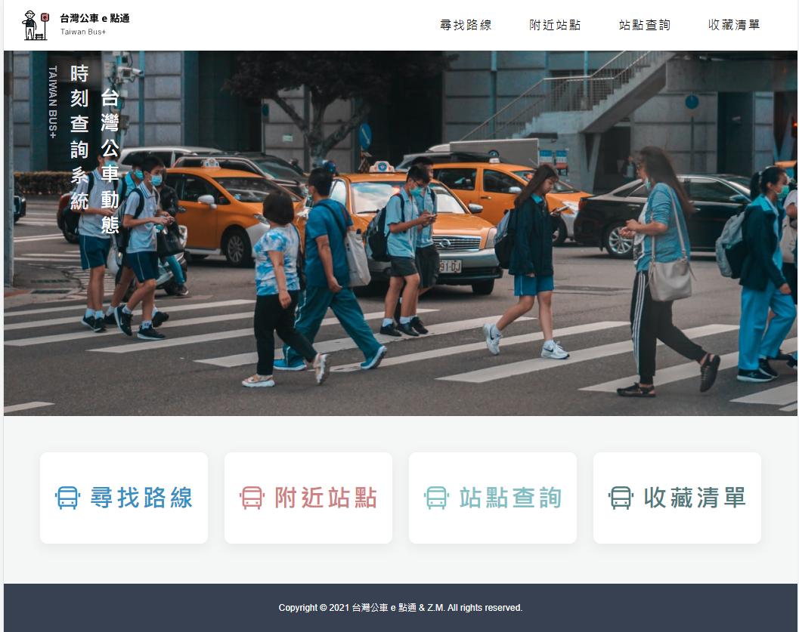

# Taiwan-Bus-Plus
[THE F2E 3rd - Week 3 - Work](https://2021.thef2e.com/news/week3)  
**UI Designer : 鹽酥G**  
[UI source](https://www.figma.com/file/JTb1ArUXnSceYEt6DmCGib/Week3---%E5%85%A8%E5%8F%B0%E5%85%AC%E8%BB%8A%E5%8B%95%E6%85%8B%E6%99%82%E5%88%BB%E6%9F%A5%E8%A9%A2%E6%87%89%E7%94%A8%E6%9C%8D%E5%8B%99?node-id=25%3A3)

> Tool keywords: [TDX api](https://tdx.transportdata.tw/api-service/swagger), react, leaflet, tailwind, scss, docker, openstreetmap-api


## Overview
This application helps people to look up the estimated arrival time of bus conveniently.
## Requirement
+ Nodejs-14

## Getting started
### Download code
```sh
$ git clone https://github.com/Zhima-Mochi/Taiwan-Bus-Plus.git
$ cd Taiwan-Bus-Plus
$ npm install
```
### Create environment file in current file path
.env
```
REACT_APP_API_ID=FFFFFFFF-FFFF-FFFF-FFFF-FFFFFFFFFFFF
REACT_APP_API_KEY=FFFFFFFF-FFFF-FFFF-FFFF-FFFFFFFFFFFF
```
[See motc ptx api documentation.](https://motc-ptx-api-documentation.gitbook.io/motc-ptx-api-documentation/)  

You can use .env.example directly.

### Run

```sh
$ npm run start : .env # Or .env.example
```
Now, have fun with http://localhost:3000/.

## Demo
+ [github page](https://zhima-mochi.github.io/Taiwan-Bus-Plus/)

## Feature & Introduction

### Upon first entering the website, you'll need to wait about 15 seconds for data to update.



### Route and stop searches use Trie (dictionary tree) for prefix word search.
> When searching for a route, you can omit the Chinese characters before the route number. For example, for the **藍32** in New Taipei City, you can search with **32**.


### Nearby stops are displayed on a map. Clicking on a stop will show which bus routes are available at that stop. Each route can link to a bus timetable.


### In the bus arrival timetable, if there's at least one stop approximately 500 meters from you, the scrollbar will automatically position itself to that stop, highlighted with a blue background.


### When there's no input and no city/county selection for stop search, the default is the stops near you.
> If there are no stops nearby, non-nearby stops will be displayed.

